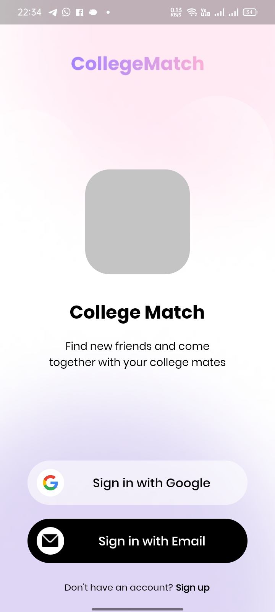
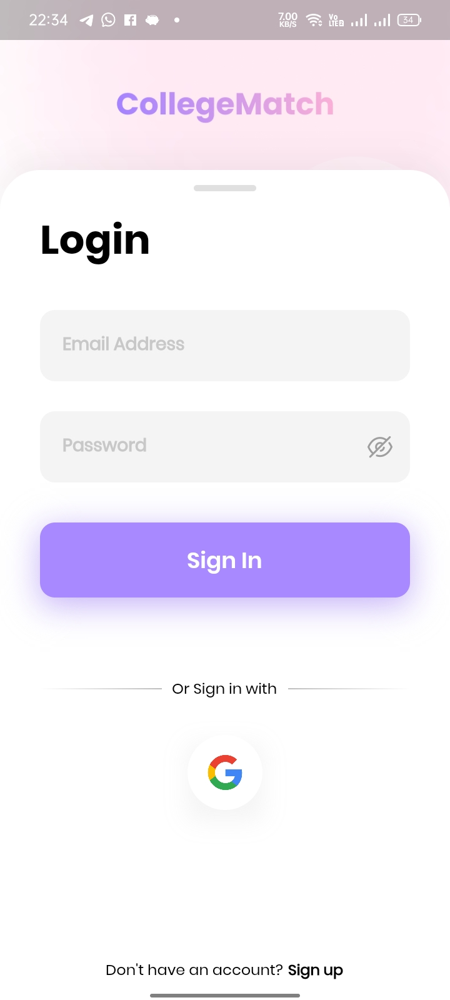
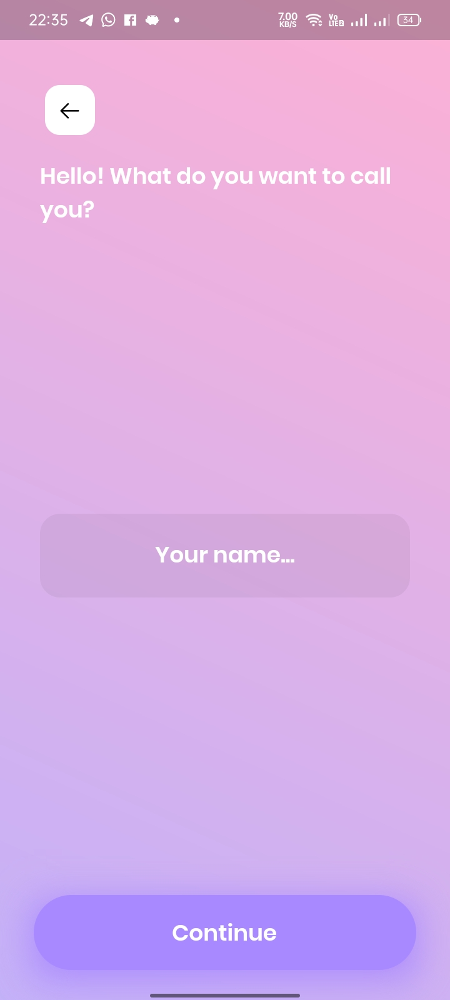
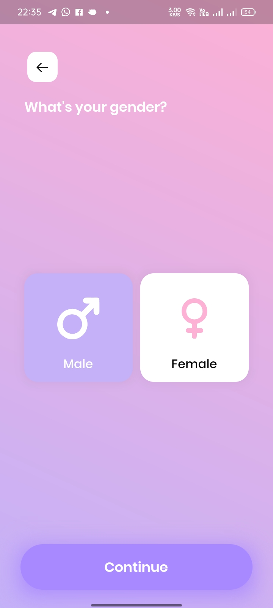
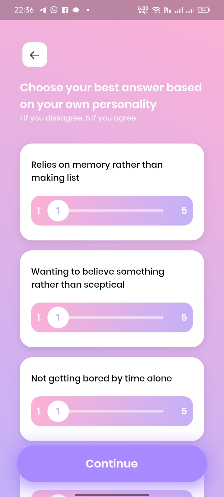
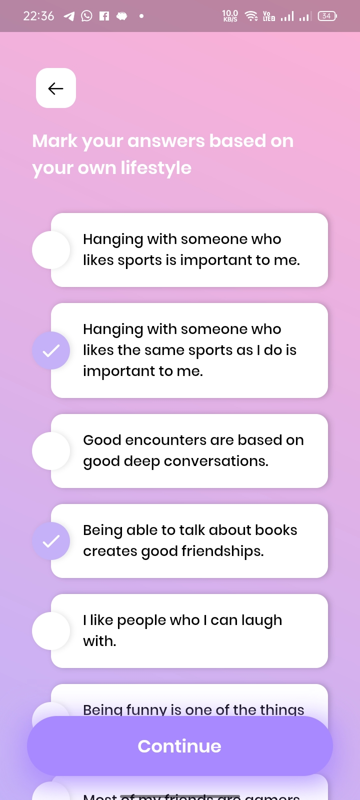
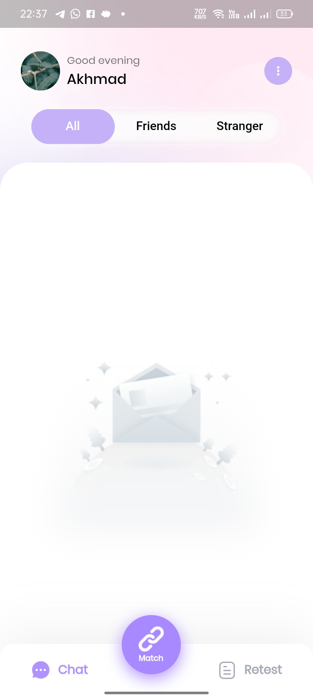
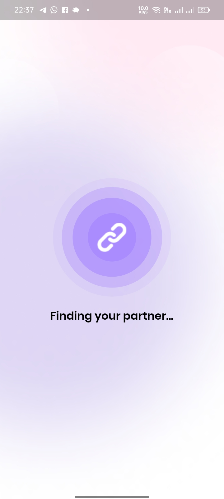
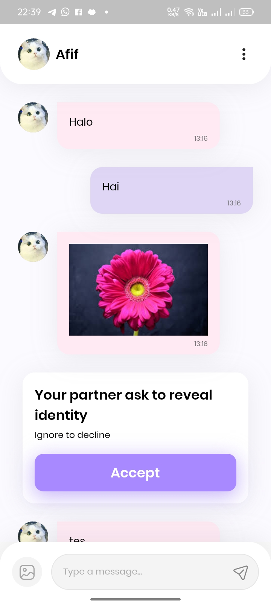

# College Match

## Screenshoot

## Related Repository

<a href="https://github.com/itstor/FinalProject-B201">Documentation Repository</a>  
<a href="https://github.com/itstor/CollegeMatch-Backend">Backend Repository</a>
